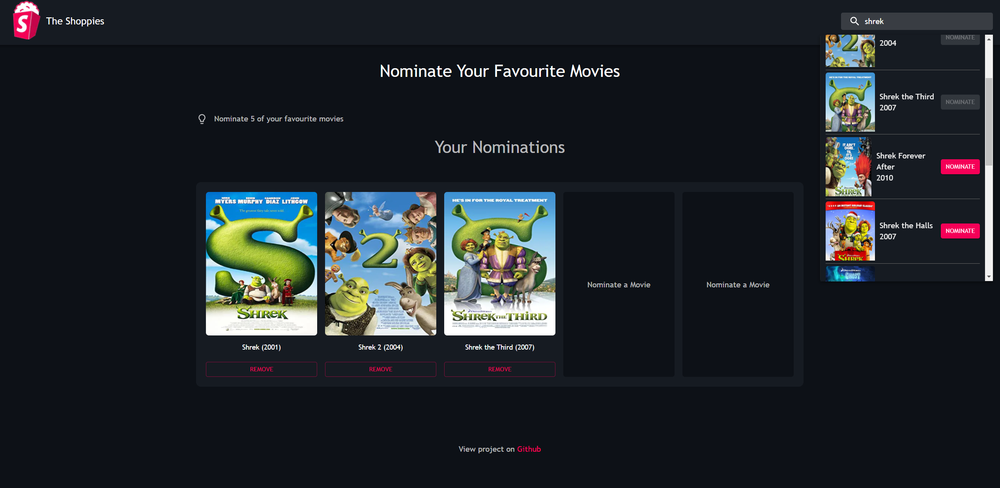
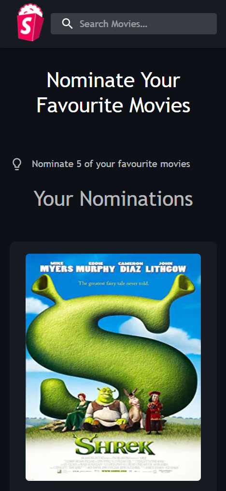

# The Shoppies

https://the-shoppies-gamma.vercel.app/

Movie nomination UI for the upcoming shoppies

Created using React, Next.js and Material-UI

## Widescreen Screenshot

## iPhone x Screenshot

## Available Scripts

In the project directory, you can run:

### `npm run dev`

Runs the app in the development mode.\
Open [http://localhost:3000](http://localhost:3000) to view it in the browser.

The page will reload if you make edits.

### `npm run build`

Builds the app for production.\
It correctly bundles React in production mode and optimizes the build for the best performance.
